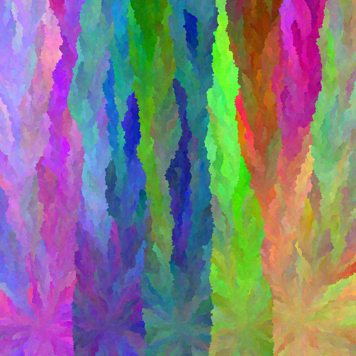

# spore

start with some seed pixels filled and the rest empty. each step, a filled pixel fills an adjacent empty pixel with its color with a random mutation.

## keybinds

- `space`: reset
- `k`: pause
- `m`: slower
- `/`: faster
- `,`: one step backwards (todo)
- `.`: one step forwards
- `j`: one second backwards (todo)
- `l`: one second forwards
- `-`: decrement number of initial seeds
- `=`: increment number of initial seeds
- `[`: decrement max color mutation
- `]`: increment max color mutation
- `p`: save/print image (rename it or else it'll get overwritten on the next save)
- `b`: highlight border
- `v` validate invariances

## renders

